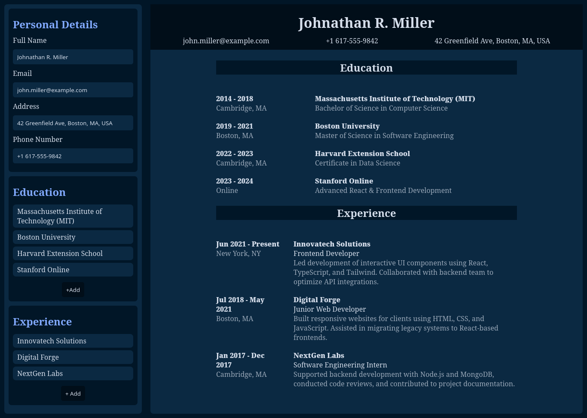

# CV Applcation

This is a very simple react based application to generate curriculum vitae. Project relies heavily on react hooks specifically `useState` for data.

## Structure

There are 2 main componenets under root

- CV (In this they are defined inside file)
- CVData
  - PersonalDetails
  - Education
  - Experience

All of the data/state is passed into the root `App` component and passed via reference to the other components.

## Theming
Theme is based on the famous `nightowl` vscode theme with slight modifications. `CSS variables` were used.